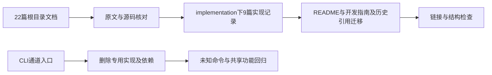

# 核心实现文档重组与通道清理

## 1. 背景、目标与非目标

docs 根目录有22篇参考、阶段方案、手测和面试文档，当前行为与历史方案混在一起。将核心内容按实现依赖重写为9篇连续记录，放入与dev同级的implementation目录，删除根目录旧文档。用户另外明确要求移除微信通道，包括代码、命令、专用依赖及测试。

不重构其他运行模块，不重新训练或评测Embedding，不删除浏览器读取公开网页的通用能力；不处理用户目录中的旧通道账号文件。保留docs/dev的历史过程，只迁移其指向旧根文档的引用。用户明确要求多篇文档和新目录，故本次实施文档集合是项目文档位置与单篇规则的明确例外；本文件仍是唯一任务方案与验收记录。

## 2. 现状分析（源码证据、已知约束）

### 2.1 架构位置

Main中存在微信独立子进程入口、交互式控制器、退出钩子与补全；CliCommandParser和ExecutionControlPolicy有专用枚举。wechat包包含账号、iLink客户端、消息循环、策略与渲染实现；pom中的ZXing只供扫码模块使用。

### 2.2 数据/状态模型

文档以当前源码校准，对旧计划的未实现增强不写成已交付。新文档顺序为基础执行、工具安全、上下文记忆、MCP/Web、浏览器、Skill、终端、Runtime API、验证评测。9篇均提供源码位置、实施步骤、失败路径和验收方式；不编造真实开发日期与测试结果。

### 2.3 核心时序与失败路径

先完成内容提取和主题映射，再创建新文件、更新链接，最后删除docs一级文件。相对链接按来源目录重新计算；旧锚点不能直接搬到新文档。只删除仓库内已列举的文档与专用通道源码，不递归删除docs/dev或用户数据。

## 3. 方案设计

### 3.1 接口与数据结构

微信命令回到UNKNOWN_COMMAND，帮助和补全移除。其专用包、测试、ZXing依赖和Main控制器删除；不影响Runtime API和共享Renderer、ToolRegistry、Policy。新记录第一篇承担导航，AGENTS/CLAUDE入口指向此处，按领域定位正文。

### 3.2 策略、安全、并发与恢复

不改变剩余工具授权链、执行队列或存储schema。删除通道线程所有启动/关闭接线，不留下无人持有的运行控制器。公开文章访问示例属于通用浏览器功能，不等同于聊天通道。原始会话、账号、环境变量和真实密钥不作为文档材料。

### 3.3 兼容性、迁移与回滚

老文档路径不再保留重定向文件，仓库引用全部迁移。旧用户通道数据留在用户目录，无自动迁移、读取或销毁。回滚通过Git恢复源文件；不创建提交、推送或PR，待用户授权。

## 4. 实现任务与测试矩阵

1. 先将命令解析与补全测试改为拒绝旧入口，验证失败。
2. 移除通道源码、依赖及所有入口接线，运行CLI/策略/Runtime针对性测试。
3. 按原文及源码重写9篇记录，迁移文档与测试注释引用，删除22篇根文档。
4. 检查新目录数量、必需章节、Mermaid围栏、相对文件链接、旧路径残留及源码定位。
5. 执行quick回归和干净构建，验证JAR无通道类与ZXing，检查git diff和diff --check。

## 5. 验收清单

- [x] docs根目录无文件；implementation下有9篇正文记录。
- [x] 新文档按从零实施顺序组织，覆盖核心架构和失败恢复，不拼接旧阶段方案。
- [x] 被删除文档的链接全部迁移；dev历史记录保留。
- [x] 通道代码、命令、补全、专用依赖和测试全部移除。
- [x] 针对性测试、quick回归、构建、产物与diff检查均完成。

### 验证记录

2026-10-09，在分支`refactor/consolidate-docs-remove-wechat`完成实现，保持未提交状态。

1. 红灯：`mvn test -DskipTests=false "-Dtest=CliCommandParserTest#rejectsRemovedWechatCommands,MainInputNormalizationTest#slashCommandHintsIncludeRagSlashCommands"`运行2项，均按预期失败，证明旧入口与补全仍存在。
2. 针对性验证：`mvn test -DskipTests=false "-Dtest=CliCommandParserTest,MainInputNormalizationTest,ExecutionControlPolicyTest,ToolRegistryTest,TurnToolPolicyTest,RuntimeApiServerTest,MainPlanAgentFactoryTest,AutomaticIndexToolIntegrationTest"`运行172项，0失败、0错误、0跳过。
3. 回归：`mvn test -Pquick`运行1367项，0失败、0错误、18跳过。未将跳过用例计为通过，也未重新执行模型质量评测或真实终端演练。
4. 构建：`mvn clean package`重试成功。项目默认跳过测试，测试证据由前两条独立命令提供。首次测试编译与首次clean遇到target产物缺失或占用；现场发现IDE Java语言服务同时维护该目录，核对源码后仅清理可再生classes/test-classes并重试，未修改无关业务代码。
5. 产物：使用Python zipfile检查最终JAR，确认无`com/codeagent/wechat/`、`com/google/zxing/`、WechatRuntimeController及WECHAT枚举；Main与WorkspaceCodeIndexManager仍存在。
6. 文档：自动检查9篇的第1至5节、Mermaid与围栏、72个本地文件链接及测试类名；docs根目录无文件，22篇旧文档名在现有受版本控制Markdown/Java中无残留引用。保留dev与superpowers子目录。
7. 差异：检查`git diff`、`git diff --check`与新增文档行尾空白，均无格式错误。删除22个通道生产文件、5个专用测试，移除ZXing依赖与Main接线；补充旧命令拒绝及补全移除断言。

用户目录中的旧账号文件未读取或删除。通用Web访问公开文章能力保留；本次未执行提交、推送或PR。
