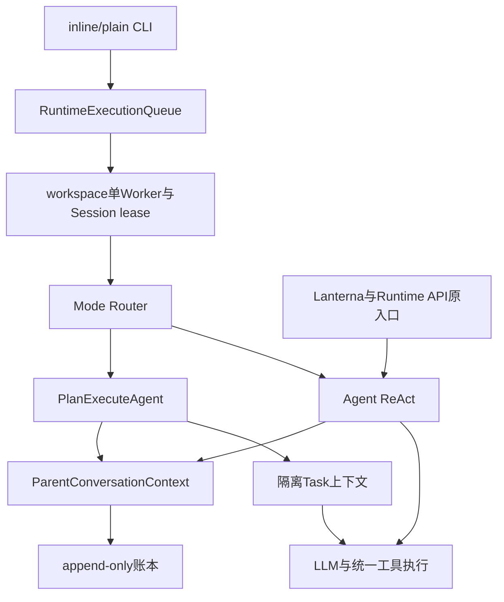

# 01. 从入口到可恢复的 Agent 执行

本系列按当前源码重新组织核心实现过程。章节顺序表示从零搭建时的依赖顺序，不代表真实提交时间；旧方案中尚未落地的能力不作为实现成果。模块的具体变更与实验仍保留在 [dev](../dev/)。

## 1. 背景、目标与非目标

第一步要解决的不是增加工具，而是让一条用户请求能够安全进入执行、跨多轮使用工具、返回结果，并在取消或崩溃后保留可解释的状态。以Java 17为基础，把CLI、模型、工具、上下文和持久化拆成边界明确的组件。

执行模式保留ReAct与统一Plan-and-Execute。普通inline/plain输入由Mode Router选择，`/react`和`/plan`只覆盖本轮。Runtime API与Lanterna保持各自入口，不能把交互式队列的恢复保证直接套到它们身上。

### 阅读与实施顺序

| 次序 | 记录 | 先建立的能力 |
|---|---|---|
| 01 | 本文 | 模型契约、执行循环、账本、路由与队列 |
| 02 | [工具、安全、诊断与快照](02-tools-policy-and-recovery.md) | 统一执行边界与修改恢复 |
| 03 | [上下文、记忆、代码索引与图片](03-context-memory-and-retrieval.md) | 有预算的请求上下文 |
| 04 | [MCP与Web](04-mcp-and-web-integration.md) | 外部工具协议与联网授权 |
| 05 | [浏览器](05-browser-session-and-guard.md) | 页面状态与登录态隔离 |
| 06 | [Skill与Prompt](06-skills-and-prompt-assembly.md) | 可覆盖的指令与按需加载 |
| 07 | [终端交互](07-terminal-rendering-and-input.md) | 输入所有权与输出生命周期 |
| 08 | [Runtime API](08-runtime-api.md) | 非交互适配与事件回放 |
| 09 | [验证与评测](09-verification-and-evaluation.md) | 单元、集成、手测与质量证据 |

## 2. 现状分析：架构与状态模型



Session是会话身份，Execution是一次顶层请求，Plan和Task是计划的执行身份。原始输入保存在Execution中，不用prompt文本充当恢复主键。Session Context Registry独占writable handle、Agent、Parent Context、MemoryManager和Skill buffer；UI当前会话指针不等于资源所有者。

## 3. 从零开始的实现步骤

### 3.1 先定义模型通信契约

通过LlmClient统一Message、Tool、Response、streaming和usage，LlmClientFactory负责Provider创建。先让纯文本请求可用，再加入工具调用与reasoning回传。Provider能力、重试和超时放在LLM层，Agent不直接拼HTTP请求。未验证的usage保持不可信，不能把缺失字段视为零成本。

规划、路由与评审使用StructuredJsonExecutor校验JSON。首次格式或业务结构失败只允许一次修复，总尝试最多两次；端点明确拒绝结构化参数时才降为普通请求，本地验证继续执行。Reviewer失败不能靠“同意”等文本关键词猜测批准。

### 3.2 再闭合ReAct工具循环

Agent先构造本轮请求，流式消费模型输出；有工具调用时进入统一工具入口，按原顺序追加结果，再请求模型。模型不再返回工具调用时结束。预算或连续相同调用停滞命中后，禁用工具进行一次部分结果收尾，不能再开启另一个无限循环。

工具执行结果与模型发送视图分离于原始账本。会话消息、工具调用、结果和边界追加到ConversationLedger，压缩和清空只改变发送视图，不能改写旧JSONL。

### 3.3 加入共享顶层上下文与Plan

ParentConversationContext维护顶层语义连续性；SessionProjection分成实际Provider发送视图和只含顶层输入、最终回答、压缩摘要的Top-level Conversation View。Planner读取后者，不读Task工具轨迹或临时注入。

Planner产出DAG，ExecutionPlan校验身份、依赖与环；PlanStateStore先严格持久化，再进入计划执行和Parent Conversation。人工计划门通过后，按资源声明选择就绪批次，Task使用独立messages。完成须同时通过确定性证据门和可用Reviewer，重试耗尽进入UNVERIFIED，不解锁后继。

### 3.4 最后把交互式运行收口到队列

输入先持久化submittedInput，Worker取得Session lease后才展开本地引用和MCP resource、读取当时顶层上下文、完成durable routing ack并执行。当前workspace只有一个顶层Worker；Plan内部仍可执行无冲突任务。

审批与计划回答交给InteractionBroker，CLI是唯一终端输入者。普通运行中输入排队；等待交互时优先回答交互，非法审批不能自动批准或变成任务。`/task add`显式排队。结束通过ExecutionFinalizer和持久化终态收敛账本与SQLite的崩溃窗口。

## 4. 实现任务与测试矩阵

| 边界 | 应先验证的失败场景 |
|---|---|
| 结构化输出 | 非法JSON、结构错误、修复仍失败、Provider拒绝参数 |
| ReAct | 空回答、工具失败、取消、重复调用、reasoning回传 |
| Plan | 环依赖、同Session双活动计划、评审不可用、证据不足 |
| 队列 | 排队不进入对话、Session FIFO、路由确认失败、退出恢复 |

执行到边界中断不保证外部副作用exactly-once。恢复时旧RUNNING/REVIEWING节点转为INTERRUPTED，从Task边界继续；EOF/shutdown停止进程内工作，保留非终态记录，不让任务脱离进程继续运行。

## 5. 验收清单与源码定位

- 请求从提交、路由、工具执行到最终回答都有确定身份与状态。
- ReAct与Plan共用基础设施，Planner只读取顶层语义，Task轨迹隔离。
- 结构化失败关闭、评审不可用及取消恢复有测试覆盖。

源码：[Agent](../../src/main/java/com/codeagent/agent/Agent.java)、[PlanExecuteAgent](../../src/main/java/com/codeagent/agent/PlanExecuteAgent.java)、[StructuredJsonExecutor](../../src/main/java/com/codeagent/llm/StructuredJsonExecutor.java)、[SessionExecutionContextRegistry](../../src/main/java/com/codeagent/runtime/execution/SessionExecutionContextRegistry.java)、[ConversationLedger](../../src/main/java/com/codeagent/history/ConversationLedger.java)。

```powershell
mvn test -DskipTests=false "-Dtest=StructuredJsonExecutorTest,ExecutionModeRouterTest,PlanExecuteAgentTest,RuntimeExecutionQueueTest,SessionExecutionContextRegistryTest"
```

持久化与恢复细节见 [统一执行Runtime](../dev/31-unified-background-execution-runtime.md)。本文列出的验证命令是模块验收入口，不表示本次文档重写逐项执行过所有命令；本次实际结果见 [重组验收记录](../dev/41-document-consolidation-and-channel-cleanup.md)。
