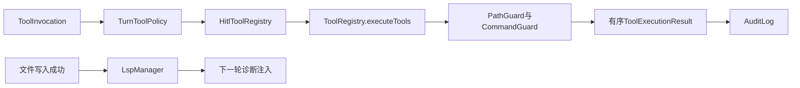

# 02. 统一工具执行、安全边界、诊断与快照

## 1. 背景、目标与非目标

Agent能够提出工具调用后，下一步是让调用具有统一的参数、授权、执行、审计和恢复路径。Prompt只能表达期望，不能代替运行时的路径与命令校验。目标是让ReAct和Plan受到同一套规则约束，并在修改出错后提供文件恢复手段。

快照、审计和账本分别记录文件版本、执行决策和会话事实，不能互相代替。快照不保证恢复外部服务或已发送的网络请求。

## 2. 现状分析：接口与边界



模型侧调用保留工具名、调用ID和参数；结果保持原始输入顺序。工具不能自行扩大路径或URL授权，审批准入也不能让已被策略拒绝的请求重新执行。

## 3. 从零开始的实现步骤

### 3.1 定义工具契约并闭合单次执行

在ToolRegistry注册工具描述与执行函数，统一解析参数、输出结构和异常。先实现read_file、glob_files、grep_code这些只读能力，再加入write_file、execute_command和revert_turn。精确定位不依赖向量索引；读取按offset/limit补上下文，不无条件返回整库正文。

接入PathGuard，规范化项目根、解析路径并校验符号链接逃逸；CommandGuard拒绝明确危险命令。命令执行在Windows用PowerShell，在类Unix用bash，并限制等待时间与输出体积。校验失败必须给出明确诊断，不能悄悄换工具执行同一动作。

### 3.2 将HITL与审计置于共享执行链

危险操作经过审批，可批准、拒绝、跳过或修改参数。修改参数后重新校验最终参数。AuditLog记录工具、结果、原因与审批来源；凭证需脱敏，报告不复制真实工具正文或会话图片。

Plan的人工计划门并不替代每个工具的安全策略。Reviewer只是检查任务结果，不能授予路径、URL或命令权限。

### 3.3 由单次执行扩展到资源感知组批

先从工具名与参数确定性推导读写资源claim；冲突调用保留原顺序分批，批内最多4并发，返回仍归并为原始顺序。无法安全解析的路径扩大claim，不让模型猜测冲突。

execute_command和revert_turn按workspace写保守独占；路径比较识别硬链接。可能人工改参的审批调用使用独占批次，Browser批次保持串行。每批结束后重新推导剩余资源，避免前一批修改文件身份后使用旧判断。

### 3.4 在写入边界追加诊断反馈

write_file成功后调用LspManager，将JavaParser语法诊断保存在pending集合。下一轮模型请求前消费并注入合成user消息。hook失败不把已成功写入报告为失败。

当前实现是Java语法诊断，不等同于完整Maven编译，也没有真实语言服务器进程池。execute_command中的任意补丁不能自动当成精确写文件事件来诊断。

### 3.5 增加独立Side-Git恢复层

使用JGit在用户目录建立独立快照仓库，避免污染项目.git。SnapshotService在turn前同步保存pre状态，在turn后调度post保存；恢复前先保存pre-restore，再恢复到目标pre-turn状态。

快照写入串行，排除构建产物与内部目录，数量受配置限制。恢复仍经过HITL和审计，不能用“恢复”绕过文件授权。对计划以顶层turn建立快照，不把每个Task都变成用户历史提交。

## 4. 实现任务与测试矩阵

| 模块 | 关键断言 |
|---|---|
| 路径与命令 | 项目外绝对路径、穿越、符号链接及危险命令拒绝 |
| 调用组批 | 同文件冲突串行、无冲突并行、硬链接冲突、结果顺序 |
| 审批 | 改参后二次校验、策略拒绝不可批准、审批状态改变失败关闭 |
| 诊断 | 写入成功触发、失败hook不改变结果、下一轮一次性消费 |
| 快照 | pre先于写入、恢复前备份、排除目录、关闭与重复恢复 |

外部命令执行失败可能已修改文件，通知索引维护时应保守要求项目校准。恢复与事务只覆盖各自责任范围，不能把文件回滚说成全系统事务。

## 5. 验收清单与源码定位

- 所有Agent工具经executeTools，策略拒绝无法被审批或降级绕过。
- 并发只用于确认无资源冲突的调用，工具结果始终有序。
- 诊断与快照异常不改写原始会话事实。

源码：[ToolRegistry](../../src/main/java/com/codeagent/tool/ToolRegistry.java)、[TurnToolPolicy](../../src/main/java/com/codeagent/tool/TurnToolPolicy.java)、[LspManager](../../src/main/java/com/codeagent/lsp/LspManager.java)、[SnapshotService](../../src/main/java/com/codeagent/snapshot/SnapshotService.java)、[SideGitManager](../../src/main/java/com/codeagent/snapshot/SideGitManager.java)。

配置：`CODEAGENT_LSP_ENABLED`默认true，`CODEAGENT_LSP_MAX_DIAGNOSTICS`默认20。快照使用`CODEAGENT_SNAPSHOT_ENABLED`、`CODEAGENT_SNAPSHOT_MAX`、`CODEAGENT_SNAPSHOT_DIR`与排除规则，具体解析以SnapshotConfig为准。

```powershell
mvn test -DskipTests=false "-Dtest=ToolRegistryTest,TurnToolPolicyTest,ApprovalPolicyTest,LspManagerTest,AgentLspDiagnosticsTest,SideGitManagerTest"
```

返回[实现记录导航](01-runtime-and-agent-foundation.md)。
