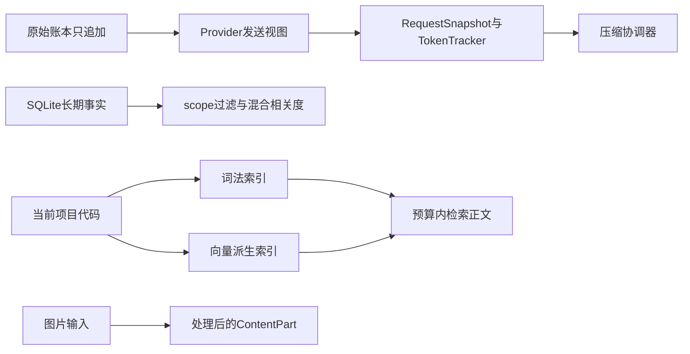

# 03. 上下文、长期记忆、代码检索与图片输入

## 1. 背景、目标与非目标

执行循环闭合后，长任务会遇到上下文增长、旧事实冲突、代码索引过期和图片重复发送。把这些问题分别落到发送视图、持久化记忆、派生代码索引和ContentPart，不建立一个含义模糊的“万能记忆库”。

目标是构造有预算、可恢复的模型请求，保留关键证据。自动压缩不承诺保留每个数字；关键判断仍需读取当前文件或重新取得事实。

## 2. 现状分析：数据与状态



原始账本不是长期记忆，项目CODEAGENT.md也不是用户保存的MemoryEntry。memory.db是长期记忆事实源；codebase-v2.db是可由源码重建的派生索引；图片payload只属于请求附件和原始会话记录。

## 3. 从零开始的实现步骤

### 3.1 先建立完整请求预算

ContextProfile按Provider声明的窗口计算压缩阈值，RequestSnapshotFactory收集实际发送内容，ContextTokenTracker预测下一轮大小。不要只统计对话正文，工具Schema、动态注入和图片也会占预算。

AutoCompactionManager优先使用启用且就绪的增量会话摘要，失效或压缩后仍超阈值时回退完整摘要。Parent Session通过durable compaction保留最近3个user轮次及工具边界；`/compact`走显式完整摘要。不同Task的预计算摘要状态隔离。

`/clear`只重置当前发送视图、预计算状态和Skill buffer，原始账本与长期记忆保留。压缩结果不能成为新的工具权限来源。

### 3.2 将长期事实持久化为独立行

LongTermMemory使用SQLite WAL、busy_timeout和事务保存MemoryEntry。旧JSON只在无迁移标记时导入；成功后SQLite成为唯一事实源，不能回退整文件快照覆盖。

MemoryWriteResolver先做canonical exact duplicate检查，再召回同作用域、同类型的active候选，由无工具关系分类器判断CREATE、DUPLICATE或SUPERSEDE。重复只刷新确认时间；替代旧事实必须引用当前顶层用户原文evidence。分类或持久化失败不得让旧事实失效。

普通检索只取当前scope可见的active条目。当前Memory语义缓存使用本地BGE，与代码RAG的Qwen分开；向量只在进程内缓存，故障降级词法。相关度乘以`0.6 + 0.4 * 2^(-ageDays/30)`，时间优先取lastConfirmedAt，缺失时回退创建时间。读取不自动确认，写入候选不应用时间衰减。

### 3.3 先闭合实时代码定位，再建立双路RAG

glob_files限定范围，grep_code定位符号或字符串，read_file读取命中上下文。这条确定性路径不依赖Embedding。遇到行为描述而缺少定位线索时，再使用search_code寻找相关实现。

CodeChunker按Java类、方法及非Java文本切块，IndexCoordinator逐文件事务维护FTS5词法与结构数据；BM25只负责词法排名。Qwen3-Embedding-0.6B FP32生成1024维向量，以cosine召回。模型需固定revision/hash预装，运行时不自动下载；remote需要匹配当前项目与模型端点的授权。

融合保留语义原序，每四位补充词法，共同命中合并来源，每文件最多3条主片段。query保留行为描述，lexical_query只提供软线索，不硬过滤语义池。默认Top10、16000正文字符；先选择完整主片段，再从扩大语义候选池中为已选文件追加最多2个完整context片段，标明行范围。Graph不参与双路融合。

### 3.4 由后台生命周期维护派生索引

交互式CLI启动WorkspaceCodeIndexManager：首次建立词法索引并异步补向量，再次启动按Hash校准。运行中递归监听文件，默认1500ms去抖、最长10000ms等待，每300秒完整校准兜底。

单JDBC连接共享访问门禁，推理在数据库锁外；向量写入校验文件/chunk Hash、任务代次、Provider代次和远程授权。旧任务不能覆盖新版本。模型失败保留词法，关闭停止任务，Provider lease释放后再销毁模型。maintenance_state只是已知待办，idle不保证全库实时新鲜。

词法刷新返回本批成功提交或确认不变的相对路径。部分文件失败时保留旧词法、失败诊断和退避校准，已成功确认的文件继续补向量；失败路径不会占据向量候选上限。不完整扫描仍禁止全局缺失删除。当前向量任务发现源版本过期、源读取失败或条件提交被拒绝时，先撤销路径资格并安排去抖词法刷新，确认后才再次发现向量；已被新代次取代的任务不能反向排队恢复。

检索片段及对应文件 Hash 在同一数据库 monitor 窗口内取得，磁盘校验在锁外与该 Hash 比较。同进程后台刷新不会把已返回的旧正文误标为 verified；该标记不证明全库实时一致，也不能替代修改前读取当前文件。

不提供用户手动索引命令。autoIndex.enabled=false只关闭后台维护；Runtime API及headless由宿主显式调用底层接口。候选文件Hash只能发现返回候选的过期，关键修改前仍要read_file。

### 3.5 最后加入结构化图片附件

ImageReferenceParser解析`@image:`路径与file URI，ClipboardImage处理剪贴板输入；ImageProcessor统一处理本地和MCP图片。原始输入有50MB处理上限，处理后的base64不超过5MB。超过API体积才缩放压缩到2000×2000范围内，小图片不因尺寸上限一律缩小；透明背景按处理策略铺白。

Message用ContentPart携带文本和图片；纯文本仍可序列化为string。Provider通过supportsImageInput声明能力，不支持时保留文本而省略payload。工具消息保留文本fallback，图片通过后续user消息回灌。新任务裁剪历史图片payload，保留来源，避免旧截图污染当前判断。

## 4. 实现任务与测试矩阵

| 边界 | 验证重点 |
|---|---|
| 压缩 | 请求全量估算、工具边界、摘要失效、Task隔离、账本不改写 |
| 记忆 | 作用域、并发重复、替代证据、事务回滚、衰减与读取不确认 |
| 索引 | 无模型仍可词法、文件删除、新目录、重启校准、旧向量拒绝 |
| 检索 | TopK与字符预算、同文件限额、context完整、空索引诊断 |
| 图片 | 空格/中文URI、非图片、超限、Provider降级、历史裁剪 |

检索证据覆盖、最终答案准确率和索引维护延迟分开报告，不把候选池覆盖率写成用户回答召回率。实验与收益见 [RAG优化过程](../dev/37-rag-optimization-process.md)。

## 5. 验收清单与源码定位

- 请求预算覆盖真实发送内容，压缩保持会话和工具边界。
- 记忆只显式写入，事实生命周期不由embedding相似度直接决定。
- 双路RAG与grep职责分开，索引时效与模型故障有诊断。
- 图片能力以当前Provider源码为准，不沿用旧“统一上传”的描述。

源码：[MemoryRetriever](../../src/main/java/com/codeagent/memory/MemoryRetriever.java)、[MemoryWriteResolver](../../src/main/java/com/codeagent/memory/MemoryWriteResolver.java)、[ImageProcessor](../../src/main/java/com/codeagent/image/ImageProcessor.java)、[WorkspaceCodeIndexManager](../../src/main/java/com/codeagent/rag/WorkspaceCodeIndexManager.java)、[RetrievalContextAssembler](../../src/main/java/com/codeagent/rag/RetrievalContextAssembler.java)。

```powershell
mvn test -DskipTests=false "-Dtest=MemoryManagerTest,MemoryRetrieverTest,ConversationHistoryCompactorTest,ImageReferenceParserTest,WorkspaceCodeIndexManagerTest,CodeSearchGoldenSetTest"
```

自动维护并发与平台限制见 [40号设计](../dev/40-automatic-code-index-maintenance.md)。返回[实现记录导航](01-runtime-and-agent-foundation.md)。
