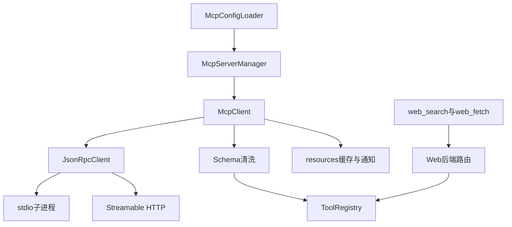

# 04. 从协议传输到统一MCP与Web工具

## 1. 背景、目标与非目标

本地工具闭合后，要接入外部工具，但不能让每个Agent单独处理子进程、HTTP、Schema和审批。先建立MCP传输与协议层，再把外部能力转换为统一工具；Web搜索和抓取在其上提供稳定门面。

本记录描述仓库已经使用的协议子集，不代替MCP标准，也不承诺OAuth、sampling或服务崩溃自动重启。Provider与搜索后端是不同配置边界。

## 2. 现状分析：模块与数据流



McpServer状态与工具注册联动，连接不可用不能继续暴露陈旧工具。工具使用`mcp__{server}__{tool}`命名空间；外部描述只是模型输入材料，不是权限来源。

## 3. 从零开始的实现步骤

### 3.1 先实现可超时的JSON-RPC关联

JsonRpcClient为请求生成ID，以并发映射保存等待响应的future，收到响应后按ID完成。无ID通知走独立监听路径。超时、关闭和错误响应必须结束future，不能让调用永久悬挂。

stdio transport用ProcessBuilder启动server，stdin写入一行JSON并flush，stdout逐行读取协议，stderr独立drain并保留有限日志。协议与诊断分流，避免stderr缓冲占满阻塞server，也避免把启动日志当JSON。

HTTP transport复用HTTP客户端处理JSON或SSE响应，保存会话header并随后续请求携带。close释放连接和会话，不让模型直接承担传输恢复逻辑。

### 3.2 加入初始化、能力与工具转换

McpClient按initialize、initialized通知、tools/list、tools/call的顺序闭合最小交互。McpSchemaSanitizer清洗模型不支持的Schema结构；原始结果中的text、image与错误状态保留在结构化输出里，图片进入统一处理器，不退化为丢失附件的字符串。

McpServerManager拥有server生命周期、工具注册与状态。交互式启动默认等待最多8秒，慢server继续STARTING，用户可用`/mcp`与`/mcp logs`追踪；关闭由生命周期所有者执行。构造普通ToolRegistry不隐式启动MCP进程，Runtime API和headless不自动创建Manager。

### 3.3 按server身份加载配置

读取用户级和项目级mcp.json，按server名称覆盖；command选择stdio，url选择HTTP。args、env、headers可展开受支持变量；缺变量显式失败。disabled配置优先，不能因为有内置默认服务就忽略用户关闭。

所有外部工具走HITL、策略和审计。日志中的headers、token、Bearer与敏感参数不得作为可分享诊断直接输出。

### 3.4 将resources接到工具与输入两条路径

声明resources能力的server提供list/read虚拟工具；用户也可以输入`@server:protocol://path`，执行前展开为resource块。只识别用户输入，不解析模型输出来自动读取资源。

tools/list_changed使同server工具全量替换；resources更新使缓存失效。system prompt可放URI、名称、描述等轻量索引，正文要显式读取。prompts命令只查看模板列表，不把外部prompt自动加入用户会话。

### 3.5 在协议工具之上建立统一Web门面

模型只看到web_search与web_fetch，默认路由到AnySearch MCP；配置允许且判定BACKEND_UNAVAILABLE时最多降级一次Step MCP。认证、额度、业务错误、拒绝和取消都不能通过换后端重试绕过。

TurnToolPolicy先检查顶层原始请求。URL授权只来自用户原文或成功搜索适配器的结构化discoveredUrls；AnySearch严格解析包络中的独立URL行，Step只消费实际structuredContent结果。网页正文、浏览器快照和普通工具文本都不授信。

审批可能改参时，按实际主用及降级后端判断独占需求；最终URL重新校验。remote重定向与DNS由MCP服务负责，不能声称本地NetworkPolicy替远端服务检查过每一次访问。

## 4. 实现任务与测试矩阵

| 边界 | 测试重点 |
|---|---|
| RPC | 乱序响应、超时、关闭、错误、通知与请求区分 |
| transport | stderr压力、无效JSON、SSE、连接失败与释放 |
| Manager | 慢启动、disabled、工具列表替换、缓存失效 |
| Web | 正确降级分类、认证不降级、改参校验、未知配置失败关闭 |
| URL | 伪造搜索文本、引用展开、并行Task隔离、声明后继继承 |

用户给出主题却未提出动作时，模型应澄清，不能靠自己的reasoning猜网址。当前项目文件任务使用本地工具，不因为“当前”二字自动联网。

## 5. 验收清单与源码定位

- 外部工具与本地工具共用执行与审计路径。
- 服务状态、缓存和工具列表收敛，不暴露已失效工具。
- Web降级不改变权限，URL来源可追溯。

源码：[McpClient](../../src/main/java/com/codeagent/mcp/McpClient.java)、[McpServerManager](../../src/main/java/com/codeagent/mcp/McpServerManager.java)、[McpConfigLoader](../../src/main/java/com/codeagent/mcp/config/McpConfigLoader.java)、[McpSchemaSanitizer](../../src/main/java/com/codeagent/mcp/protocol/McpSchemaSanitizer.java)、[WebToolBackendRouter](../../src/main/java/com/codeagent/web/WebToolBackendRouter.java)。

```powershell
mvn test -DskipTests=false "-Dtest=JsonRpcClientTest,McpClientTest,McpSchemaSanitizerTest,McpServerManagerTest,WebToolBackendRouterTest,AnySearchResultParserTest,StepSearchResultParserTest"
```

统一联网细节见 [Web路由设计](../dev/27-unified-web-tool-routing.md)。下一步：[浏览器状态与隔离](05-browser-session-and-guard.md)。
