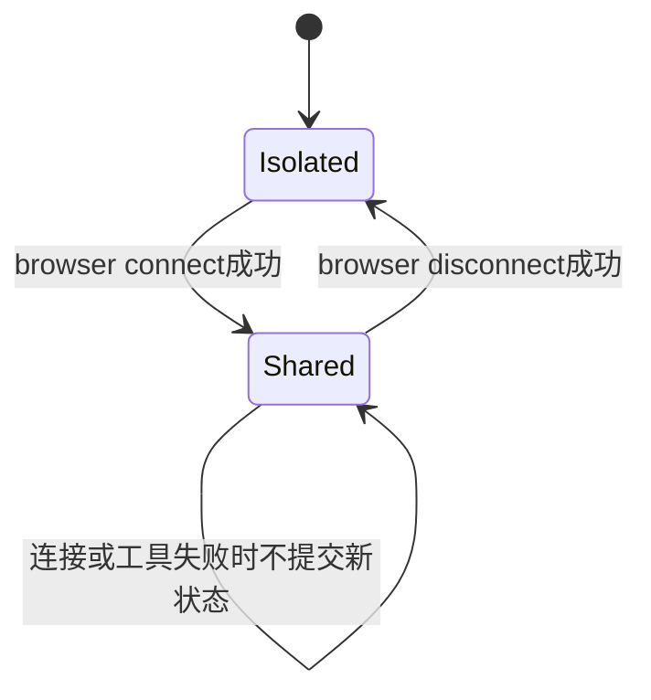

# 05. 浏览器接入、登录态复用与页面隔离

## 1. 背景、目标与非目标

普通抓取拿不到动态页面时，需要浏览器执行JavaScript并取得可读快照。浏览器还可能携带用户登录态，因此接入目标不仅是“工具能调用”，还要限定哪个页面可以读取、改写或关闭。

使用Chrome DevTools MCP作为工具后端，CodeAgent持有连接模式、当前页、页面所有权与审批规则。不会自动登录、保存Cookie到自己的数据库，也不创建额外浏览器引擎。

## 2. 现状分析：模式与状态



ISOLATED是独立浏览器环境，SHARED复用用户Chrome。BrowserSession记录实际模式、最近成功导航以及CodeAgent创建的标签页。策略不能只根据命令意图判断模式，配置切换失败时不得伪造成功状态。

## 3. 从零开始的实现步骤

### 3.1 先让隔离浏览器经MCP工作

把chrome-devtools注册为MCP server，按同一启动、Schema、审批和AuditLog路径调用。先验证new_page、navigate、take_snapshot的闭环，再验证截图通过MCP Content转为图片附件。

模型接收页面快照而不是浏览器内部对象；图片处理与其他输入共享ImageProcessor。对文字内容应取得snapshot，对视觉布局使用截图，不能把截图路径当成已读懂页面的证据。

### 3.2 再增加用户Chrome连接与回滚

`/browser connect`切换autoConnect模式，显式端口路径作为兼容CDP连接；disconnect切回isolated。BrowserConnector和连接检查用于确认实际服务可用，重启MCP失败时恢复此前配置，不留下“配置已变、会话没变”的状态。

连接共享Chrome复用其登录态，账号密码与Cookie仍由Chrome管理。用户可在浏览器里登录，Agent不因连接成功获得任意页面写权限。

### 3.3 用页面所有权保护用户已有标签页

BrowserGuard识别改写工具和close_page。shared模式禁止关闭非CodeAgent创建的标签页；当前页不归Agent所有时，导航或改写被拒绝，要求先new_page打开目标。

成功导航回执只能建立当前页上下文，不能授信页面里出现的其他URL。工具返回的全量Pages列表在回灌前裁为允许的页面回执，防止模型把用户其它标签页当成新的任务范围。

### 3.4 敏感页面增加单步审批

SensitivePagePolicy对有效URL匹配规则；命中敏感页且工具具有改写行为时强制本次审批，不能复用“全部放行”。规则与URL授权同时作用，审批不能批准TurnToolPolicy已经拒绝的访问。

BrowserGuard预览检查不提交导航状态，只有带成功语义的执行结果才更新Session。工具超时、业务失败或取消后不能假设页面已按目标切换。

### 3.5 将浏览器与Web协作约束接回Agent

URL来自本轮顶层用户原文或成功搜索授信结果。用户明确要求交互才开放改写工具；“读页面”不自动包含点按钮、上传、提交表单或关闭标签页。

浏览器无法取得正文时，报告失败及已有证据，不凭页面标题生成正文。Plan分支的URL能力按声明的依赖传递，不从任务回答文本重新生成凭据。

## 4. 实现任务与测试矩阵

| 场景 | 验收断言 |
|---|---|
| 模式切换 | connect成功才提交模式，失败恢复，disconnect返回隔离 |
| shared旧页 | 只读授权受限，导航/改写/关闭拒绝 |
| Agent新页 | 成功创建后记录所有权，关闭后清理 |
| 敏感页面 | 改写必须单步审批，拒绝无替代执行 |
| MCP结果 | 失败不更新Session，页面列表不扩大可见范围 |
| 截图 | MIME、尺寸、体积与Provider图片能力一致 |

单元测试可验证状态与策略；真实Chrome启动、登录态复用和终端审批仍需人工集成演练，不能拿模拟工具结果代替实机验证。

## 5. 验收清单与源码定位

- 连接模式、页面身份、工具授权三者独立验证。
- 用户已有页面受保护，敏感改写不复用批量审批。
- 浏览器失败不污染当前状态或产生新的URL权限。

源码：[BrowserConnector](../../src/main/java/com/codeagent/browser/BrowserConnector.java)、[BrowserSession](../../src/main/java/com/codeagent/browser/BrowserSession.java)、[BrowserGuard](../../src/main/java/com/codeagent/browser/BrowserGuard.java)、[SensitivePagePolicy](../../src/main/java/com/codeagent/browser/SensitivePagePolicy.java)。

```powershell
mvn test -DskipTests=false "-Dtest=BrowserSessionTest,BrowserGuardTest,BrowserConnectivityCheckTest,SensitivePagePolicyTest,TurnToolPolicyTest,McpToolRegistrationTest"
```

返回[实现记录导航](01-runtime-and-agent-foundation.md)。
