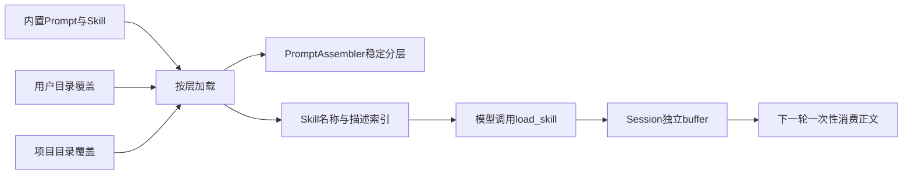

# 06. 分层Prompt与渐进式Skill加载

## 1. 背景、目标与非目标

有了多种执行模式与外部工具后，如果把全部指令写在Java字符串里，改规则会牵动多个角色。另一方面，每轮发送所有Skill正文会挤占上下文。先把稳定Prompt变成分层资源，再为Skill增加轻量索引与按需正文。

目标是支持项目覆盖和用户覆盖，同时控制注入体积与生命周期。Skill不作为权限令牌，也不建立独立的子Agent运行系统。

## 2. 现状分析：数据结构与边界



PromptRepository负责文件选择，PromptAssembler负责顺序、变量和必需段校验。SkillRegistry管理发现与启用状态，SkillContextBuffer只保存待消费正文，不能成为全局共享缓存。

## 3. 从零开始的实现步骤

### 3.1 先抽出静态Prompt资源与装配器

将base、personality、mode、approvals、context management和handoff放到内置资源。PromptAssembler按固定顺序拼装，再加入项目上下文、Skill索引和运行时信息。当前日期与时区放在末尾，减少前缀缓存变化范围。

PromptMode指定角色文件，PromptContext提供变量和动态内容。Reviewer禁用工具时剥离工具段并加入无工具约束，不复用执行Agent的完整权限提示。

### 3.2 定义覆盖顺序并使错误显式化

内置资源最低，用户`~/.codeagent/prompts/`覆盖其上，项目`.codeagent/prompts/`优先。覆盖是整文件替换，不进行字段merge或任意include。base及最终组装必须有`## Language`段，缺失时失败，避免项目覆盖悄悄移除约束。

项目CODEAGENT.md通过既有读取顺序装入项目上下文，导入文件限定在授权根内。Prompt覆盖改变文本，不改变PathGuard、TurnToolPolicy或HITL的真实行为。

### 3.3 用目录与frontmatter发现Skill

Skill是含SKILL.md的目录，name与description为核心元信息。SkillFrontmatterParser处理已支持的简单语法，不宣称完整YAML兼容。错误条目跳过并诊断，不阻止其他Skill加载。

扫描顺序为内置、用户、项目，同名后者整体替换前者。启用状态由SkillStateStore保存，禁用条目不进入索引；内置文件由资源加载与提取组件处理，不依赖源码目录在运行机器存在。

### 3.4 先注入索引，再按需加载正文

SkillIndexFormatter只将名称和描述放入system prompt，限制数量与总字符量；当前最多20个、索引4096字符、description限制500。不能把字符数称为精确UTF-8字节数或token数。

模型调用load_skill后，正文按工具预算截断进入当前Session的SkillContextBuffer。buffer最多3个同名去重条目，重复加载更新顺序；drain一次性消费。下一轮将正文作为动态上下文注入，稳定system前缀不随每次正文加载重复改写。

### 3.5 接入CLI管理与生命周期

`/skill list/show/on/off/reload`负责检查与管理；show是查看，不能把历史方案中的自动注入草图当成已实现语义。ToolRegistry在切换Session时重绑对应buffer，Task上下文不共享其他角色的临时指令。

`/clear`清空buffer和当前发送视图，但保留持久化禁用状态。MCP资源、Skill文本或Prompt中的网址不自动成为URL授权来源。

## 4. 实现任务与测试矩阵

| 层次 | 验证重点 |
|---|---|
| PromptRepository | 项目覆盖、用户覆盖、缺失必需文件 |
| PromptAssembler | 固定顺序、Language缺失、变量替换、无工具Reviewer |
| Skill发现 | frontmatter失败、同名覆盖、禁用、资源包运行 |
| 索引预算 | description截断、数量上限、字符上限 |
| buffer | 同名去重、3条淘汰、一次性消费、Session隔离 |

修改Prompt时先列出目标输入、期待工具与禁止行为，再用Provider请求快照或可控LLM验证；不要仅以“模型回答看起来更好”作为安全边界验收。

## 5. 验收清单与源码定位

- 相同角色的指令只有一个装配入口，覆盖优先级可预测。
- Skill索引与正文分离，动态正文有预算与消费生命周期。
- Prompt和Skill不扩大工具权限，不污染其他Session。

源码：[PromptRepository](../../src/main/java/com/codeagent/prompt/PromptRepository.java)、[PromptAssembler](../../src/main/java/com/codeagent/prompt/PromptAssembler.java)、[SkillRegistry](../../src/main/java/com/codeagent/skill/SkillRegistry.java)、[SkillIndexFormatter](../../src/main/java/com/codeagent/skill/SkillIndexFormatter.java)、[SkillContextBuffer](../../src/main/java/com/codeagent/skill/SkillContextBuffer.java)。

```powershell
mvn test -DskipTests=false "-Dtest=PromptAssemblerTest,SkillRegistryTest,SkillFrontmatterParserTest,SkillIndexFormatterTest,SkillContextBufferTest"
```

Prompt修改的证据记录方式见 [验证与评测](09-verification-and-evaluation.md)。返回[实现记录导航](01-runtime-and-agent-foundation.md)。
