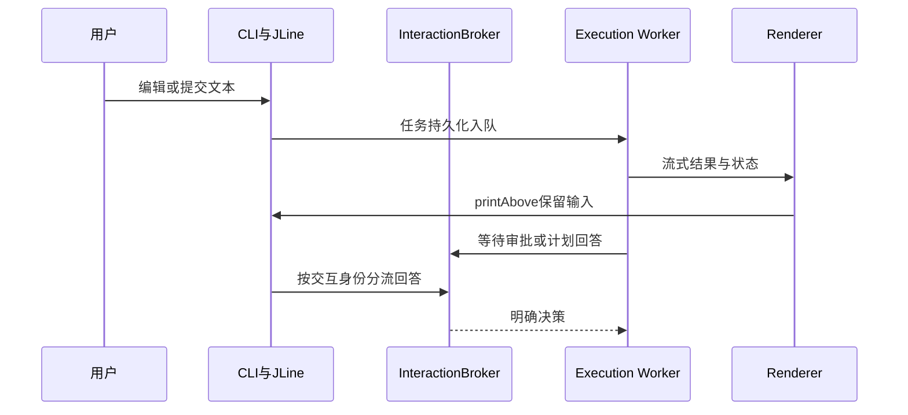

# 07. 从普通输出到可持续交互的终端

## 1. 背景、目标与非目标

工具循环、流式回答和审批都可能在用户编辑输入时输出。直接向stdout打印会打断输入或覆盖历史，多个线程同时读取终端会误消费审批回答。先确定输入所有权，再建立Renderer，最后加入状态栏、折叠与可切换形态。

默认inline保持可滚动transcript；plain负责兼容退化；Lanterna保留全屏交互。三个形态共享领域行为，不复制Agent逻辑。

## 2. 现状分析：模块与时序



CLI输入循环是唯一终端输入者。Worker输出走Renderer.stream，审批等待Broker，不另开readLine。后台消息与当前输入是两个生命周期。

## 3. 从零开始的实现步骤

### 3.1 先定义Renderer并保留plain兜底

抽出stream、状态、工具块、输入前后等接口。PlainRenderer尽量保持普通打印行为，为非ANSI环境和测试提供稳定输出。Agent、Planner、Plan执行器接同一输出流，主交互路径不新增裸System.out.println。

RendererFactory读取系统属性codeagent.renderer，随后CODEAGENT_RENDERER，默认inline；兼容旧CODEAGENT_TUI=true到Lanterna。未知值回退inline；终端不支持ANSI时再退为plain。Lanterna由TuiBootstrap接管，不假设工厂一定构造全屏窗口。

### 3.2 用JLine保持编辑缓冲区

InlineRenderer绑定LineReader，用户正在读取时用printAbove显示异步内容。普通任务和斜杠命令提交后回显原始输入，让执行结果有可追踪的触发内容。

CodeAgentCompleter集中提供命令、Provider、MCP server/resource、Skill和本地路径候选；Highlighter只作视觉提示，不能把高亮当成命令授权。未知斜杠命令由CliCommandParser拒绝，不能回退Agent。

### 3.3 将持久正文与临时活动区分开

transcript只追加，底部状态由托管区域绘制。thinking用固定高度live区域，每次只重写自己占用的行，内容和工具边界先清理live区域再追加正文。

不使用独立Display或CLEAR_TO_EOS清理历史。TerminalMarkdownRenderer按显示宽度处理中文、emoji和表格单元格换行，状态栏resize时重新计算宽度。

### 3.4 用数据对象管理工具块、折叠和diff

FoldableBlock、BlockRegistry保存可折叠内容与当前活跃身份；工具输出完成且后续正文推进后冻结旧块。Ctrl+O只操作允许的活跃块，不能回头改写已经滚走的transcript。

InlineDiffRenderer为文本变更显示差异，二进制、大文件或不适合展开的内容走有限摘要。原始工具结果仍进入工具轨迹，显示截断不应改变真实工具执行结果。

### 3.5 接入状态与交互控制

BottomStatusBar展示模型、phase、ctx、token、cost、elapsed以及MCP/Skill摘要。ctx表示下一轮会携带的上下文估算，usage表示调用消耗，不能混用。退出或取消时清理临时区域，保留已完成正文。

计划与HITL由InteractionInputRouter按pending身份接回答；审批、普通任务和显式追加任务不能争用输入。`/clear`重置发送视图，不清除原始会话或长期记忆。

## 4. 实现任务与测试矩阵

| 验证层 | 核心场景 |
|---|---|
| 单元 | 字符显示宽度、状态构造、折叠生命周期、diff fallback |
| 输入集成 | 异步printAbove时缓冲保留、补全、未知命令拒绝 |
| ANSI smoke | 不覆盖正文、清理只在自有区域、resize与取消 |
| 实机手测 | 小终端、dumb终端、禁色、Ctrl+C、Ctrl+O、审批与多行输入 |

### 手测实施顺序

先用plain运行读文件与写文件任务，再切inline检查异步输出时编辑缓冲不丢失；产生工具块后折叠，输出后续回答后再按Ctrl+O，确认旧块冻结。随后验证审批拒绝、跳过与改参，不仅检查批准路径。

最后缩小终端、调整窗口大小、运行长表格、取消任务和退出。Lanterna单独检查文件树、编辑器、会话切换与全屏恢复；不能以inline测试通过代替全屏验收。手测记录环境、输入、预期、实际和未测项。

## 5. 验收清单与源码定位

- 用户编辑与后台输出同时存在时，输入和已完成历史保持可读。
- 所有交互只由CLI读取，Worker等待Broker。
- 退化路径、冻结块与临时区关闭有独立验证。

源码：[RendererFactory](../../src/main/java/com/codeagent/render/RendererFactory.java)、[InlineRenderer](../../src/main/java/com/codeagent/render/inline/InlineRenderer.java)、[BottomStatusBar](../../src/main/java/com/codeagent/render/inline/BottomStatusBar.java)、[CodeAgentCompleter](../../src/main/java/com/codeagent/cli/CodeAgentCompleter.java)、[TuiBootstrap](../../src/main/java/com/codeagent/tui/TuiBootstrap.java)。

```powershell
mvn test -Pphase16-smoke
mvn test -DskipTests=false "-Dtest=MainInputNormalizationTest,BottomStatusBarTest,InteractionInputRouterTest,TerminalMarkdownRendererTest"
```

实现环境变量使用CODEAGENT_RENDERER=inline/plain/lanterna；更多开关以 [.env.example](../../.env.example) 为准。返回[实现记录导航](01-runtime-and-agent-foundation.md)。
