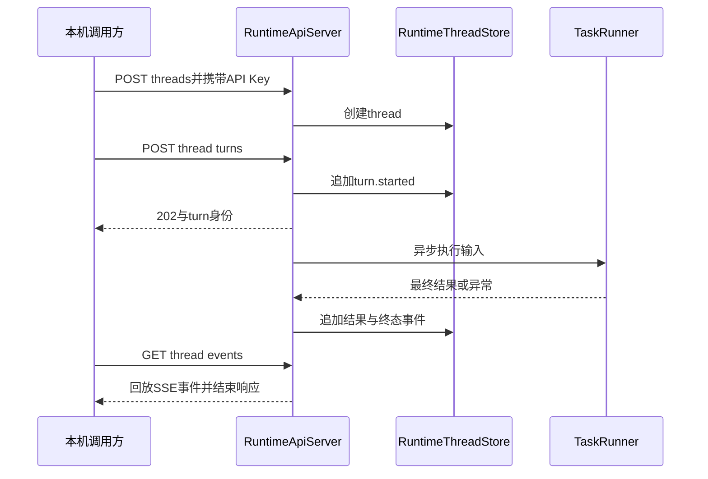

# 08. 从执行核心到Runtime HTTP API

## 1. 背景、目标与非目标

交互式CLI能够运行后，外部调用方需要通过稳定接口提交任务并读取事件。先将非交互执行抽成TaskRunner，再增加thread身份、事件存储和HTTP适配，避免把终端输入或Renderer直接暴露给网络客户端。

当前API是本机threads/turns/events接口，不是完整OpenAI Assistants API，也不等同于inline/plain的统一Execution队列。它使用headless ReAct，不接入Mode Router、终端HITL或默认自动索引维护器。

## 2. 现状分析：身份、事件与边界



thread是API侧事件容器，turn是提交的运行请求。不能把API thread直接视为CLI Session的writable上下文租约。RuntimeThreadStore保留事件，调用方从事件判断完成或失败。

## 3. 从零开始的实现步骤

### 3.1 先抽出headless执行适配

TaskRunner接收输入并返回结果，Main.runHeadlessTask构造非交互Agent依赖。ToolRegistry构造不自动启动MCP或索引线程；没有生命周期所有者时外部能力按不可用契约处理，不假装与交互式CLI能力完全一致。

不提供终端审批交互的入口必须保留适用策略，不能因为无人输入就自动批准危险动作。headless错误通过调用结果或事件表达，不写进用户的交互会话。

### 3.2 再实现thread与追加事件存储

RuntimeThreadStore创建thread并检查存在性，所有运行进度写为事件。先验证创建、事件顺序和关闭，再让HTTP层依赖这个存储接口。数据库失败不得报告任务已完成。

事件可能含输入和答案，因此API访问也需要身份校验。事件回放不等于去敏，使用评测或分享日志前要单独筛选内容。

### 3.3 用JDK HttpServer增加本机入口

RuntimeApiServer只绑定127.0.0.1，构造时要求非空API Key。key来自codeagent.runtime.api.key或CODEAGENT_RUNTIME_API_KEY，接受Authorization Bearer或X-CodeAgent-API-Key头。认证在路由处理前完成，不提供默认公开key。

端点保持最小集合：POST /v1/threads创建容器，POST /v1/threads/{id}/turns提交非空input，GET /v1/threads/{id}/events读取SSE。未知thread返回404，空输入返回400，未授权返回401。

### 3.4 异步执行并形成明确终态

提交turn后立即返回202，executor执行TaskRunner，结果写入message.delta和turn.completed，异常写turn.failed。当前message.delta记录最终结果，不应在文档中宣称模型逐token实时推送。

GET events回放当前持久化事件并结束响应，不维持无限阻塞的订阅连接。SSE包含id、event和data，调用方可使用`?after=<event-id>`继续读取后续事件。server关闭同时释放executor和HTTP资源，不创建进程退出后继续运行的服务。

### 3.5 与CLI队列保持边界清晰

CLI的任务由RuntimeExecutionStore、单Worker、Session lease和ExecutionFinalizer处理；API仍独立。不能把CLI的FIFO、计划恢复和Session连续性保证自动套到API。

若未来统一两种入口，应先显式定义thread与Session绑定、审批回答协议和生命周期，再改执行入口；仅复用一张数据库表不足以证明语义一致。

## 4. 实现任务与测试矩阵

| 范围 | 关键场景 |
|---|---|
| 认证 | 缺key启动失败，两种header，错误key拒绝 |
| HTTP | 创建thread、未知路径、不存在thread、空输入 |
| 异步 | 202先返回，成功和失败各有终态 |
| 事件 | SSE格式、顺序、回放完成关闭响应 |
| 生命周期 | server关闭、executor释放、headless依赖明确 |

单元和本机HTTP测试不代表生产部署、跨机器鉴权或长期流连接已验证。API输入上限、运行并发限制及更多部署策略属于独立后续设计。

## 5. 验收清单与源码定位

- API仅本机监听且必须认证，返回状态与事件对应。
- headless与交互式CLI能力差异在入口契约中明确。
- 接口不声称持续SSE订阅、完整Assistants兼容或外部副作用exactly-once。

源码：[RuntimeApiServer](../../src/main/java/com/codeagent/runtime/api/RuntimeApiServer.java)、[RuntimeThreadStore](../../src/main/java/com/codeagent/runtime/api/RuntimeThreadStore.java)、[TaskRunner](../../src/main/java/com/codeagent/runtime/task/TaskRunner.java)、[Main](../../src/main/java/com/codeagent/cli/Main.java)。

```powershell
mvn test -DskipTests=false "-Dtest=RuntimeApiServerTest,CliCommandParserTest"
# 在当前PowerShell设置自己的本机API Key后启动；不要提交或记录真实key
java -jar target/codeagent-1.0-SNAPSHOT.jar serve --http --port 8080
```

CLI队列的实施与恢复见 [统一执行Runtime](../dev/31-unified-background-execution-runtime.md)。返回[实现记录导航](01-runtime-and-agent-foundation.md)。
