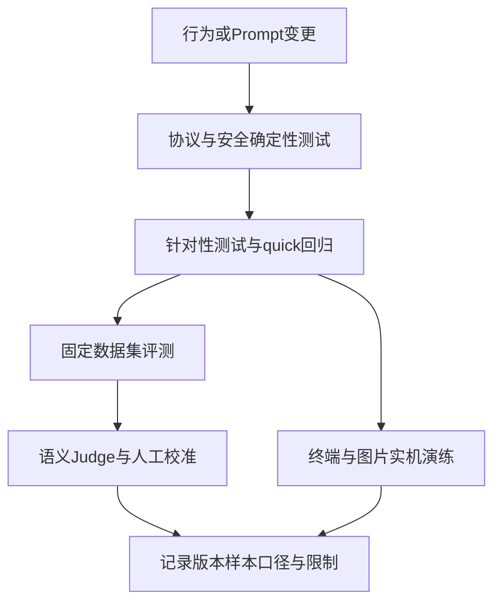

# 09. 从功能断言到检索与Agent质量评测

## 1. 背景、目标与非目标

系统能运行不等于满足目标。先验证确定性协议与权限，再建立代码定位黄金集、RAG证据覆盖评测和语义Judge，最后补终端与图片实机演练。把“可重复执行的断言”和“模型质量判断”分开，避免测试数字被误用。

旧面试文档中的其它项目经历、虚构业务场景和泛化建议不进入本系列。这里只保留本仓库可追溯的实现与验证方法，不编造真实用户效果或把历史手测清单写成已经执行。

## 2. 现状分析：验证层次



日志、评测报告和原始会话是不同产物。原始JSONL可能包含密钥、工具正文与图片，不自动整份传给Judge。测试次数、数据样本数、检索候选数和成功率必须分别解释。

## 3. 从零开始的实现步骤

### 3.1 先用最小失败测试锁定行为

新增或删除命令时同步parser、执行入口、帮助与补全测试。改工具时验证真实执行边界；改Prompt时记录输入、期待行为、缺口和权限风险，使用可控Provider与request snapshot核对。

测试先证明当前行为不符合目标，再实现最小改动，运行对应测试。quick负责常规回归；需要外部服务、原生终端或模型的用例要注明条件和跳过原因，不能把跳过算成通过。

### 3.2 建立确定性代码定位黄金集

src/test/resources/code-search/golden-set.json定义question、pattern、glob、expectedPath与expectedText。CodeSearchGoldenSetTest强制Java fallback，不依赖机器安装ripgrep。

每题限制grep结果预算，断言路径与行号、suggested_reads，然后用read_file读取附近上下文并检查预期文本。这证明grep/read在预算内能取得目标证据，不评测自然语言语义召回。

新增样本使用真实定位目标。只有模糊行为描述、无法提取稳定grep线索的问题进入RAG评测，不把两种集合混合成一个含义不明的成功率。

### 3.3 再建立RAG证据覆盖口径

固定语料、查询、标注证据、模型、候选池、TopK和字符预算。分别测语义、词法与融合，记录是否在返回正文里包含必要证据。候选池覆盖是可能的上限，最终预算内正文覆盖才接近工具提供给Agent的信息。

稀疏标注的Precision@K不能等同完整相关性；无答案题返回候选不表示Agent可以回答。自动维护测试单独验证改动到索引收敛，不能把时效收益归因于Embedding准确率。当前实验过程与数字保留在 [RAG优化过程](../dev/37-rag-optimization-process.md) 与 [真实仓库评测](../dev/36-rag-repository-evaluation.md)。

### 3.4 将语义评测做成独立Judge组件

LlmJudge接收显式提供的候选答案、参考与筛选轨迹。Rubric给出维度、权重和硬性失败条件；模型只返回逐维评分、证据与hardFailures，Java计算总分和是否通过。非法JSON、缺失/重复维度或越界评分明确失败。

PositionBalancedPairwiseJudge比较新旧答案两次，第二次交换A/B；只有两次指向同一个逻辑候选才接受胜者。位置不一致时TIE并标记，避免把位置偏好当成版本收益。

确定性安全规则仍由代码先判，不能交给Judge决定是否合法。当前eval/benchmark提供数据定义、trace、脱敏、聚合与产物存储组件，但不据此宣称已有通用批量Runner、自动读取会话或`/eval`命令。

### 3.5 建立独立的执行过程诊断

`/better-harness [quick|normal] [--inline]`通过BetterHarnessRunner收集证据，交由三个只读分析角色并行检查，再由主模型汇总候选发现，最后由Java生成报告。分析不直接修改业务代码，也不代替工具权限校验。

默认将Markdown、HTML和结构化发现写入项目的`.codeagent/better-harness/<run-id>/`；`--inline`只返回报告，不持久化文件。实现依次区分证据收集、分析、汇总、渲染与完成阶段，测试覆盖选项解析和报告生成。报告中的建议仍需结合源码与确定性测试验证。

源码：[BetterHarnessRunner](../../src/main/java/com/codeagent/harness/BetterHarnessRunner.java)、[BetterHarnessOptions](../../src/main/java/com/codeagent/harness/BetterHarnessOptions.java)；自动验收入口为BetterHarnessRunnerTest、BetterHarnessOptionsTest。

### 3.6 补图片与终端的实际验收

图片依次测本地路径、含空格与中文file URI、非法文件、大小限制、剪贴板无图、MCP截图、多图回灌及历史裁剪。路径解析失败后说明错误，不偷偷把后面的自然语言吞进路径。

终端依次测plain兜底、inline异步编辑、折叠冻结、审批拒绝与改参、状态resize、取消退出，再测Lanterna。记录硬件、OS、终端、JDK、命令、结果与未测项；截图只是显示证据，不能替代协议或权限断言。

## 4. 实现任务与测试矩阵

| 对象 | 自动验收入口 | 额外证据 |
|---|---|---|
| 精确定位 | CodeSearchGoldenSetTest | grep/read正文预算 |
| RAG | CodeSearchServiceArchitectureTest、RepositoryEvaluationDatasetTest | 固定语料与模型实验 |
| 语义Judge | LlmJudgeTest、PositionBalancedPairwiseJudgeTest | 人工校准及位置一致率 |
| Prompt | PromptAssemblerTest、StructuredJsonExecutorTest | 实际发送request snapshot |
| 图片 | ImageReferenceParserTest与Provider图片测试 | 本机剪贴板和截图 |
| 终端 | phase16-smoke与输入测试 | 真实终端手测 |

每份质量报告列明数据集版本、模型、阈值、TopK、预算、样本量、失败项和token来源。Provider未给出可信usage时标为估算或未知，不记作零。

## 5. 验收清单与源码定位

- 确定性正确性、检索覆盖和最终答案质量分别报告。
- Judge位置偏差和数据集标注边界可见。
- 文档列出的命令与本次实际执行结果明确区分。

源码：[LlmJudge](../../src/main/java/com/codeagent/eval/LlmJudge.java)、[PositionBalancedPairwiseJudge](../../src/main/java/com/codeagent/eval/PositionBalancedPairwiseJudge.java)、[SecretRedactor](../../src/main/java/com/codeagent/eval/benchmark/SecretRedactor.java)、[CodeSearchGoldenSetTest](../../src/test/java/com/codeagent/tool/CodeSearchGoldenSetTest.java)。

```powershell
mvn test -DskipTests=false "-Dtest=CodeSearchGoldenSetTest,LlmJudgeTest,PositionBalancedPairwiseJudgeTest,ImageReferenceParserTest"
mvn test -Pquick
mvn test -Pphase16-smoke
mvn clean package
git diff --check
```

项目默认mvn clean package跳过测试，所以构建成功不代表测试已运行。独立测试的真实结果与本次迁移清单见 [文档重组与通道清理验收](../dev/41-document-consolidation-and-channel-cleanup.md)。返回[实现记录导航](01-runtime-and-agent-foundation.md)。
