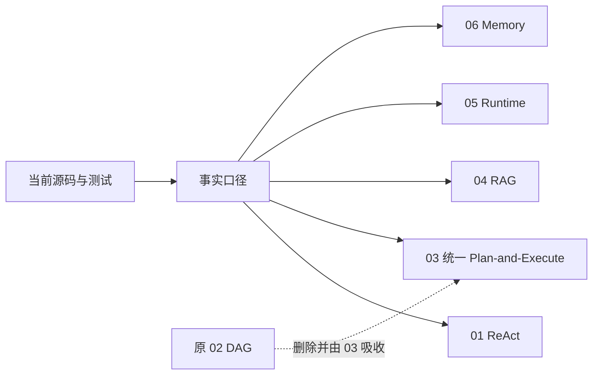

# 开发文档 01–06 一致性修订设计

日期：2026-09-19

## 1. 目标与非目标

目标是让 `docs/dev` 的简历支撑文档与当前源码保持一致：明确删除原 02，将 DAG、Plan-and-Execute 与步骤级 Reviewer 协作统一收敛到 03，并修正 01、03–06 中因统一多 Agent 重构、路径差异和测试环境造成的矛盾描述。

本次不修改 Java 源码、运行时行为、简历原始能力边界，也不重写与已发现问题无关的章节。

## 2. 修改范围

- 保持 `docs/dev/02-dag-orchestration.md` 删除，不创建占位页。
- `01-react-agent.md`：移除已删除 `AgentOrchestrator` 的现存实现引用，更新 Plan 交叉链接和失效证据。
- `03-multi-agent-collaboration.md`：成为唯一 Plan-and-Execute 文档；修正 URL 权限收紧语义、CLI/TUI child session 边界和测试证据。
- `04-code-rag-graph.md`：如实标注 `CodeIndexTest` 的 Embedding 外部依赖与 Windows 路径测试边界，修正失效行号。
- `05-runtime-api-tasks.md`：删除独立 Team 模式表述，统一为 ReAct 与 `/plan`；更新无头路径限制和源码位置。
- `06-memory-context.md`：把旧 Team/Worker 记忆描述改为当前的 Plan 任务执行体与 Reviewer SubAgent 差异，清理 `AgentOrchestrator` 引用并更新测试边界。

## 3. 一致性原则

1. 代码行为优先于旧文档和旧简历措辞。
2. 已删除类型只能作为历史背景出现，不能作为当前接线证据。
3. 安全语义必须精确：补充要求既可增加 URL 授权，也可通过显式禁网要求收紧工具暴露。
4. 测试存在不等于测试当前通过；环境依赖或跨平台失败必须明确标注。
5. 保留对当前实现边界的诚实说明，不把原型能力包装成分布式或强一致系统。

## 4. 验收标准

- 文件系统中不存在 02，01、03–06 不再把它当有效文档链接。
- 当前能力说明中不再引用已删除的 `AgentOrchestrator`、`ExecutionStep`、`StepStatus` 或独立 `/team` 入口。
- 03 不再包含“禁网可收紧”与“权限只增不减”的矛盾。
- 03 明确 child session 只在注入 `parentSession` 的入口生效，当前 CLI 有、TUI 无。
- 04 的测试章节区分真实能力、外部 Embedding 依赖和 Windows 测试夹具问题。
- 05 的无头限制使用“统一 `/plan`”而不是“Plan/Team”。
- 06 明确 Plan 任务执行体会读取长期记忆，Reviewer SubAgent 不主动检索长期记忆。
- 文档中的关键源码引用可定位到对应符号；执行链接扫描、矛盾关键词扫描和 `git diff --check`。

## 5. 风险与回滚

风险主要是大篇幅文档中存在同义重复，局部修订可能漏掉旧称谓。通过全仓关键词扫描和逐篇差异检查降低遗漏。修改均为 Markdown，可按文件逐项回滚，不影响运行时。
